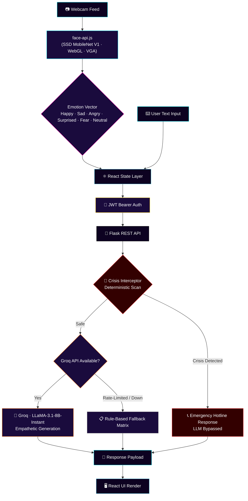

<div align="center">


# 🧠 MoodLens
### *Havan — The Emotion-Aware Chat Assistant*

**Where Computer Vision meets Conversational Intelligence.**
A real-time facial telemetry engine fused with a generative AI core — built to *feel* before it speaks.

<br/>

[](#)
[](#)
[](#)
[](#)
[](#)

<br/>

[**🚀 Live Demo**](#) · [**📐 Architecture**](#-system-architecture) · [**⚙️ Setup**](#-getting-started) · [**📡 API Docs**](#-api-reference)

</div>

<br/>

<div align="center">

</div>

<br/>

---

## 🌌 What is MoodLens?

> MoodLens is not just a chatbot. It is a **bi-modal empathy engine**.

While conventional assistants read *what* you type, MoodLens reads *how you feel while you type it*. A lightweight computer-vision layer runs entirely **client-side**, streaming real-time emotional telemetry (Happy, Sad, Angry, Surprised, Fearful, Neutral) directly into the conversational context — giving the LLM a window into your affective state *before* it crafts a response.

Underneath the polished interface sits a hardened, security-first backend: JWT-secured, cross-origin-ready, and engineered with a **deterministic Crisis Interceptor** that can override the AI entirely when safety matters most.

<br/>

---

## ✨ Core Capabilities

<table>
<tr>
<td width="50%" valign="top">

### 👁️ The Omni-Sensor
Real-time facial micro-expression detection powered by `face-api.js` (SSD MobileNet V1), running locally in-browser via WebGL. Throttled to VGA resolution for optimal VRAM efficiency without sacrificing detection accuracy.

</td>
<td width="50%" valign="top">

### 🧬 Fused Context Pipeline
Emotional telemetry and text input are merged into a single contextual payload — giving the AI core a multi-dimensional view of user state, not just literal words.

</td>
</tr>
<tr>
<td width="50%" valign="top">

### ⚡ Groq-Powered Reasoning
Sub-second inference via the Groq API running **LLaMA-3.1-8B-Instant** — empathetic, context-aware responses generated at LPU-grade speed.

</td>
<td width="50%" valign="top">

### 🛡️ Crisis Interceptor
A deterministic safety layer that scans for severe negative emotional patterns and crisis-language markers, **bypassing the LLM entirely** to deliver verified emergency resources when it matters most.

</td>
</tr>
<tr>
<td width="50%" valign="top">

### 🔄 Graceful Degradation
If Groq rate-limits or fails, MoodLens seamlessly falls back to a curated, rule-based empathetic response matrix — zero downtime, zero broken UX.

</td>
<td width="50%" valign="top">

### 🔐 Hardened Auth Layer
Flask + SQLAlchemy + JWT-Extended, using header-based Bearer tokens engineered for fully cross-origin, stateless authentication.

</td>
</tr>
</table>

<br/>

---

## 🗺️ System Architecture

The MoodLens pipeline is a multi-stage data fusion process — from raw pixels to empathetic prose.



<br/>

---

## 🧰 Tech Stack

<table>
<tr><th align="center">🎨 Frontend</th><th align="center">⚙️ Backend</th><th align="center">🧠 AI / ML</th></tr>
<tr>
<td align="center" valign="top">


</td>
<td align="center" valign="top">


</td>
<td align="center" valign="top">


</td>
</tr>
</table>

<br/>

---

## ⚙️ Getting Started

<details>
<summary><b>🖥️ Frontend Setup (React)</b></summary>

<br/>

```bash
# Clone the repository
git clone https://github.com/Madhavan-dev18/Havan-A-Emotion-Aware-Chat-Assistant.git
cd Havan-A-Emotion-Aware-Chat-Assistant/frontend

# Install dependencies
npm install

# Run the development server
npm run dev
```

> **Note:** `face-api.js` model weights are loaded via CDN at runtime — no local model bundling required. Ensure the browser has camera permissions enabled for the Omni-Sensor to initialize.

</details>

<details>
<summary><b>🐍 Backend Setup (Flask)</b></summary>

<br/>

```bash
cd Havan-A-Emotion-Aware-Chat-Assistant/backend

# Create and activate a virtual environment
python -m venv venv
source venv/bin/activate   # Windows: venv\Scripts\activate

# Install dependencies
pip install -r requirements.txt

# Initialize the database
flask db upgrade

# Run the API server
flask run
```

</details>

<details>
<summary><b>🔑 Environment Variables</b></summary>

<br/>

Create a `.env` file in the `backend/` directory with the following keys:

| Variable | Description |
|---|---|
| `GROQ_API_KEY` | API key for Groq's LLaMA-3.1-8B-Instant inference |
| `JWT_SECRET_KEY` | Secret used to sign and verify JWT Bearer tokens |
| `DATABASE_URL` | SQLAlchemy database connection string |
| `FLASK_ENV` | `development` / `production` |
| `CORS_ORIGINS` | Comma-separated list of allowed frontend origins |

</details>

<br/>

---

## 📡 API Reference

<details>
<summary><b>🔐 POST /api/auth/login — Authenticate User</b></summary>

<br/>

Returns a signed JWT Bearer token for use in the `Authorization` header of subsequent requests.

```json
// Request
{
  "username": "demo_user",
  "password": "••••••••"
}

// Response
{
  "access_token": "eyJhbGciOiJIUzI1NiIsInR5cCI6IkpXVCJ9...",
  "token_type": "Bearer"
}
```

</details>

<details>
<summary><b>💬 POST /api/chat — Send Fused Message</b></summary>

<br/>

Accepts text input alongside the live emotion vector captured by the Omni-Sensor. Triggers the Crisis Interceptor scan before routing to Groq.

```json
// Request — Header: Authorization: Bearer <token>
{
  "message": "I've had a really rough day...",
  "emotion_vector": {
    "dominant": "sad",
    "scores": {
      "happy": 0.02,
      "sad": 0.81,
      "angry": 0.03,
      "surprised": 0.01,
      "fearful": 0.05,
      "neutral": 0.08
    }
  }
}

// Response
{
  "reply": "That sounds genuinely heavy. Want to talk through what happened?",
  "source": "groq",
  "interceptor_triggered": false
}
```

</details>

<details>
<summary><b>🚨 Crisis Interceptor — Response Schema</b></summary>

<br/>

When deterministic crisis-pattern matching fires, the LLM is bypassed entirely:

```json
{
  "reply": "It sounds like you're going through something serious. You're not alone — please reach out to a crisis helpline.",
  "source": "crisis_interceptor",
  "interceptor_triggered": true,
  "resources": [
    { "name": "National Helpline", "contact": "<region-specific hotline>" }
  ]
}
```

</details>

<br/>

---

## 🛣️ Roadmap

- [ ] Voice-tone fusion as a third telemetry signal
- [ ] Persistent emotional history visualization dashboard
- [ ] Multi-language Crisis Interceptor keyword sets
- [ ] WebSocket-based streaming responses

<br/>

---

<div align="center">

### 🛰️ Deployment

**Frontend** →  &nbsp;|&nbsp; **Backend** → 

<br/>

**Built with precision by [Madhavan](https://github.com/Madhavan-dev18)**

⭐ *If MoodLens resonates with you, consider starring the repo.*

</div>
