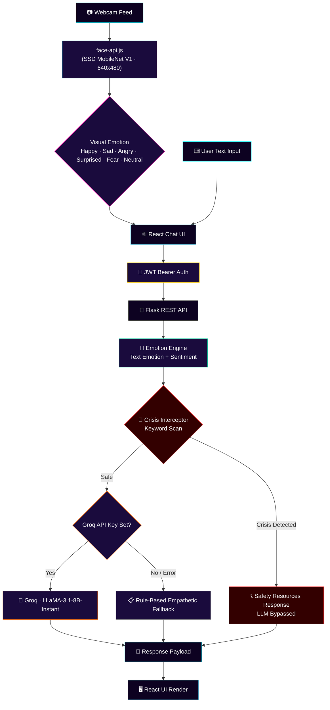

<div align="center">


# 🧠 Havan
### *Emotion-Aware Conversational AI*

**Where Computer Vision meets Conversational Intelligence.**
A real-time facial telemetry engine fused with a generative AI core — built to *feel* before it speaks.

<br/>

[](#)
[](#)
[](#)
[](#)

<br/>

[**📐 Architecture**](#-system-architecture) · [**⚙️ Setup**](#-getting-started) · [**📡 API Docs**](#-api-reference)

</div>

<br/>

<div align="center">

</div>

<br/>

---

## 🌌 What is Havan?

> Havan is not just a chatbot. It is a **bi-modal empathy engine**.

While conventional assistants read *what* you type, Havan reads *how you feel while you type it*. A lightweight computer-vision layer runs entirely **client-side**, streaming real-time facial emotion telemetry (Happy, Sad, Angry, Surprised, Fearful, Neutral) alongside your text — giving the LLM a window into your affective state before it crafts a response.

Underneath the interface sits a security-first Flask backend: JWT-secured (header-based Bearer tokens, no fragile cross-origin cookies), rate-limited, and engineered with a **keyword-based Crisis Interceptor** that scans every message and can bypass the LLM entirely when safety matters most.

<br/>

---

## ✨ Core Capabilities

<table>
<tr>
<td width="50%" valign="top">

### 👁️ Facial Emotion Scanner
Real-time facial expression detection powered by `@vladmandic/face-api` (SSD MobileNet V1), running locally in-browser. Capped at 640×480 to avoid VRAM overflow, with built-in lighting and face-distance diagnostics and a rolling confidence buffer for smoothing.

</td>
<td width="50%" valign="top">

### 🧬 Fused Context Pipeline
Text emotion analysis and live visual emotion are merged into a single payload per message — giving the AI core both *what* you said and *how you looked* while saying it.

</td>
</tr>
<tr>
<td width="50%" valign="top">

### ⚡ Groq-Powered Reasoning
Sub-second inference via the Groq API running **LLaMA-3.1-8B-Instant**. The system prompt is dynamically built from the user's detected text emotion and visual emotion so responses match their state.

</td>
<td width="50%" valign="top">

### 🛡️ Crisis Interceptor
A deterministic, keyword-based safety scan runs on every message. If crisis-language markers are detected, the LLM is bypassed entirely and a fixed safety message with crisis resources is returned instead.

</td>
</tr>
<tr>
<td width="50%" valign="top">

### 🔄 Graceful Degradation
If the Groq API key is missing, rate-limited, or the call fails, Havan falls back to a curated emotion-matched response dictionary — zero downtime, zero broken UX.

</td>
<td width="50%" valign="top">

### 🔐 Hardened Auth Layer
Flask + SQLAlchemy + Flask-JWT-Extended + Bcrypt, with header-based Bearer auth, access/refresh token rotation, and Flask-Limiter rate limiting.

</td>
</tr>
</table>

<br/>

---

## 🗺️ System Architecture

The Havan pipeline fuses two emotion signals — text and face — before generating a response.



---

## 🧰 Tech Stack

| Layer | Technology |
| --- | --- |
| Frontend | React 19, Vite, React Router, Tailwind CSS, Axios |
| Facial Emotion | `@vladmandic/face-api` (SSD MobileNet V1) |
| Backend | Flask 3, Flask-SQLAlchemy, Flask-Bcrypt, Flask-JWT-Extended, Flask-Limiter, Flask-Cors |
| LLM | Groq API (`llama-3.1-8b-instant`) |
| Text Emotion Engine | HuggingFace Transformers (optional, RAM-gated) with rule-based keyword fallback |
| Database | SQLite (dev) / PostgreSQL (production via `psycopg2`) |
| Deployment | Vercel (frontend), Render-style WSGI via Gunicorn (backend) |

---

## ⚙️ Getting Started

```bash
# Clone the repository
git clone https://github.com/Madhavan-dev18/Havan-A-Emotion-Aware-Chat-Assistant.git
cd Havan-A-Emotion-Aware-Chat-Assistant/frontend

# Install dependencies
npm install

# Run the development server
npm run dev
```

> **Note:** `@vladmandic/face-api` model weights are bundled/loaded by the frontend at runtime. Ensure the browser has camera permissions enabled for the facial emotion scanner to initialize.

```bash
cd Havan-A-Emotion-Aware-Chat-Assistant/backend

# Create and activate a virtual environment
python -m venv venv
source venv/bin/activate   # Windows: venv\Scripts\activate

# Install dependencies
pip install -r requirements.txt

# Run the API server
python run.py
```

Create a `.env` file in the `backend/` directory with the following keys:

| Variable | Description |
| --- | --- |
| `SECRET_KEY` | Flask secret key |
| `JWT_SECRET_KEY` | Secret used to sign and verify JWT Bearer tokens |
| `DATABASE_URL` | SQLAlchemy database connection string (defaults to local SQLite) |
| `GROQ_API_KEY` | API key for Groq's LLaMA-3.1-8B-Instant inference |
| `GROQ_MODEL` | Model name (default: `llama-3.1-8b-instant`) |
| `MAX_MEMORY_TURNS` | Number of past messages sent as conversation history (default: 10) |
| `ALLOWED_ORIGINS` | Comma-separated list of allowed frontend origins for CORS |
| `USE_ML_MODELS` | Set to `true` to enable HuggingFace transformer pipelines (requires >1GB RAM); defaults to a lightweight rule-based emotion/sentiment engine |

---

## 📡 API Reference

### `POST /api/auth/register`
Creates a new user account and returns access/refresh tokens.

### `POST /api/auth/login`
Authenticates with username/email + password and returns access/refresh tokens.

```json
// Request
{
  "username": "demo_user",
  "password": "••••••••"
}

// Response
{
  "user": { "id": 1, "username": "demo_user", "display_name": "demo_user", "avatar_emoji": "🤖" },
  "access_token": "eyJhbGciOiJIUzI1NiIsInR5cCI6IkpXVCJ9...",
  "refresh_token": "eyJhbGciOiJIUzI1NiIsInR5cCI6IkpXVCJ9..."
}
```

### `POST /api/chat/sessions/<session_id>/messages`
Accepts text input alongside the live visual emotion captured by the facial scanner. Runs the text emotion engine and Crisis Interceptor before routing to Groq.

```json
// Request — Header: Authorization: Bearer <token>
{
  "content": "I've had a really rough day...",
  "visual_emotion": "sad"
}

// Response
{
  "user_message": { "id": 12, "role": "user", "content": "I've had a really rough day...", "emotion": { "primary": "sadness", "visual": "sad", "sentiment": "negative" } },
  "assistant_message": { "id": 13, "role": "assistant", "content": "That sounds genuinely heavy. Want to talk through what happened?" },
  "emotion": { "primary_emotion": "sadness", "emotion_scores": { "...": "..." }, "sentiment": "negative", "is_crisis": false },
  "response_source": "groq_llm"
}
```

When the Crisis Interceptor fires on keyword-based detection, the LLM is bypassed entirely and `response_source` is `"safety_interceptor"`, returning a fixed message with crisis helpline resources.

---

## 🛣️ Roadmap

* [ ] Voice-tone fusion as a third telemetry signal
* [ ] Persistent emotional history visualization dashboard
* [ ] Multi-language Crisis Interceptor keyword sets
* [ ] WebSocket-based streaming responses
* [ ] Live deployment links (frontend + backend)

---

**Built by [Madhavan](https://github.com/Madhavan-dev18)**

⭐ *If Havan resonates with you, consider starring the repo.*
